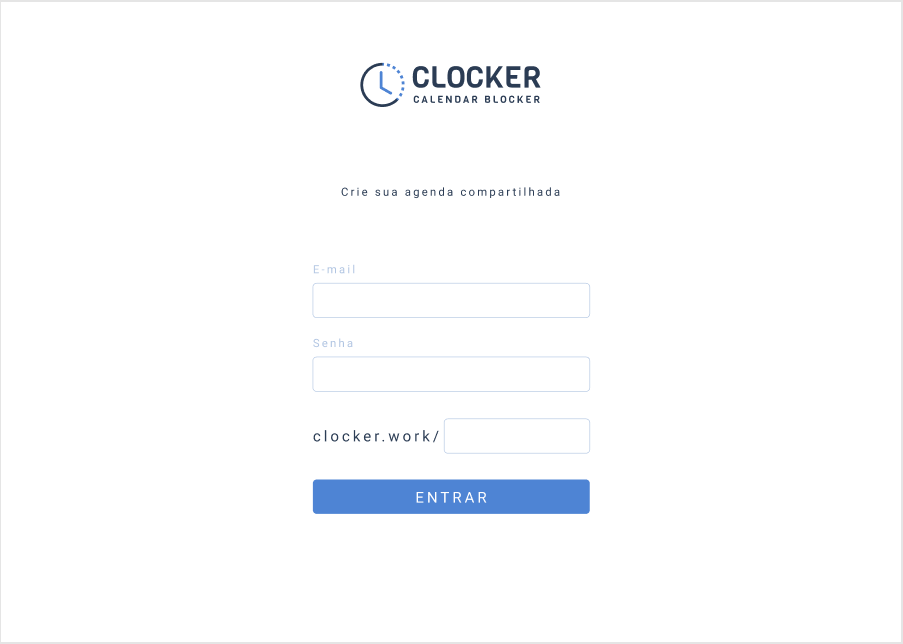
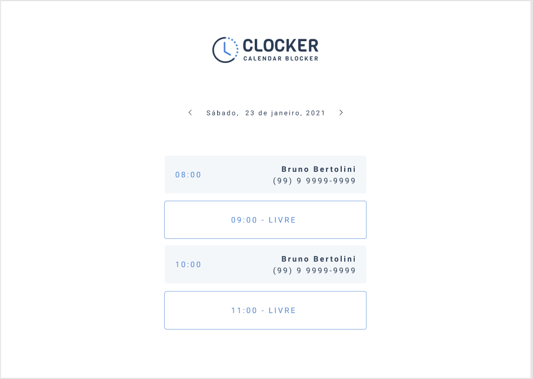
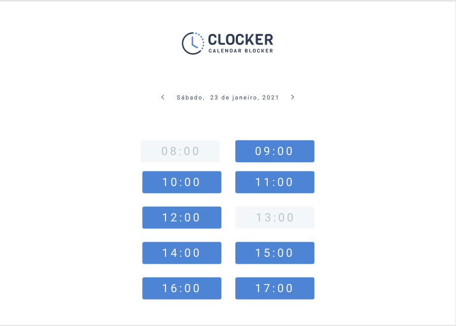

&nbsp;
# Clocker Work
   

&nbsp;
- [Clocker Work](#clocker-work)
  - [Sobre](#sobre)
  - [Features](#features)
  - [Pré-requisitos](#pré-requisitos)
  - [Screenshots](#screenshots)
  - [Tecnologias](#tecnologias)
  - [Como iniciar aplicação](#como-iniciar-aplicação)
  - [Deploy do projeto](#deploy-do-projeto)

&nbsp;
## Sobre
Projeto desenvolvido durante projeto full-stack da [codar.me](https://codar.me/).

## Features
- [x] Cadastro de usuário
- [x] Login
- [x] Calendário de horários
- [x] Agenda pública e privada

## Pré-requisitos
- [Node.Js](https://nodejs.org/en/)
- [VSCode](https://code.visualstudio.com/)

## Screenshots





&nbsp;

## Tecnologias
- [Next.Js](https://nextjs.org/)
- [Firebase](https://firebase.google.com/?hl=pt)

## Como iniciar aplicação
```bash

# Clone a aplicação
$ https://github.com/julio-lemos/cloker.git

# Preencha as informações do seu projeto firebase no seu arquivo .env (.env.example no projeto)

# Instale as dependências
$ yarn

# Inicie o projeto
$ yarn dev

```

## Deploy do projeto
https://clocker-murex.vercel.app/login

&nbsp;

🎇 Thanks for all.